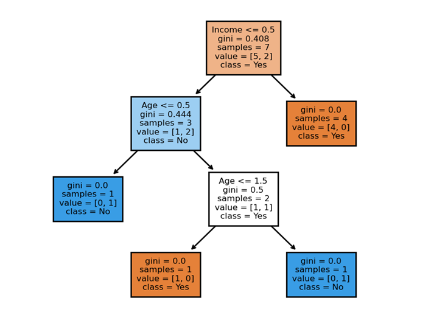

## How does the Decision Tree Algorithm work?

Decision Tree ... My favorite ML algorithm ... "Hello world" of the ML algorithms ... simple yet powerful..!

I have experienced in my carrier as Lead Data Scientist that aspiring data scientist or data scientists who have just started there carrier in data science domain, most of times they will be asked to explain the ML algorithm they like. Most of them, will choose decision tree. Though they have read about algorithm and used it extensively in several projects, due to not having clear steps in mind and no preparation for followup questions, they won't be handle it and there confidence will get shatter. So, to help them to understand and explain it in easy manner, today I am writing this article. 

> If you can't explain it simply, you don't understand it well enough! - **Albert Einstein**  

Let me provide explanation in simple steps, firstly  will provide explanation for `What is decision tree algorithm and how it works?` (*sufficient to answer question like how algorithm works?*), then material to create a simple `Decision Tree in Excel, R and Python` (*for better understanding*) on toy data set that I have created. This  will help you to understand working of the decision tree algorithm. Finally, I will provide some `Follow-up Questions` (*food for brain*) which might be asked to check your understanding about the algorithm.


#### Table of Contents
1. [ What is decision tree algorithm and how it works?](#section1) <br>
1. [ Decision Tree in Excel, R and Python](#section2) <br>
    2.1 [Decision tree in Excel](#section3) <br>
    2.2 [Decision tree in R](#section4) <br>
    2.3 [Decision tree in Python](#section5) <br>
1. [ Follow-up Questions](#section6) <br>
1. [ Data & Code on GitHub](#section7) <br>
   

### 1. What is decision tree algorithm and how it works?  <a name="section1"></a>

> - <u>Decision tree is</u> all about the creating a tree from the given labeled data. 
> - <u>Here the idea is</u> to represent the labeled data as a tree where `internal node` / `decision node` represents the `condition on attributes` of the data given to that node , each `branch` represents the `outcome of that condition` and each `leaf node` represents the `class label`.
> - <u>To build a tree</u>, we need to decide `which question to ask` and `when to ask`?
> - <u>To get answers for these questions/conditions and there order</u>, we need to provide all the labeled data to root node and iterate through all the attributes for features in data set and calculate `impurity / information gain` for each attribute.
> - <u>To calculate impurity / information gain</u>, we can use `entropy` (*measure of uncertainty*) or `GINI index` (*measure of information gain*)
> - <u>After splitting root node based on criteria</u>, same process will be repeated `recursively` for newly crated nodes with remaining rows till no attribute or no instance is remaining.

### 2. Decision Tree in Excel, R and Python <a name="section2"></a>
As I have already mentioned, if you want to understand some concepts in depth then better way crate it from scratch and understand how it works. I have created decision tree in excel from scratch. Let's see how the steps mentioned above will help us to create the decision tree in excel. I am also code in  R and python for better understanding.

#### 2.1 Decision Tree in Excel <a name="section3"></a>

For this experiment, I have created following toy data, with 2 features `Age` and `Income` and target variable is `Loan Approved`.


Now let's start to apply steps mentioned earlier -

> - <u>To build a tree</u>, we need to decide `which question to ask` and `when to ask`?
> - <u>To get answers for these questions/conditions and there order</u>, we need to provide all the labeled data to root node and iterate through all the attributes for features in data set and calculate `impurity / information gain` for each attribute.
> - <u>To calculate impurity / information gain</u>, we can use `entropy` (*measure of uncertainty*) or `GINI index` (*measure of information gain*)

- So, I have provided data all rows to root node and calculated impurity for all the features and attributes.
- After first pass, as shown in below figure you can see that total impurity for Income feature is less means information gain is more. Hence, we can split the tree based on its attributes.
- As we can see for attributes medium low instances are already classified, we can use condition / question `Income == medium or low`.


> - <u>After splitting root node based on criteria</u>, same process will be repeated `recursively` for newly crated nodes with remaining rows till no attribute or no instance is remaining.

- So after first split, we will provided remaining rows from dataset to 2 nodes created based on condition `Income == medium or low`. First branch where condition is true is already classified as entropy is 0 for them. For second branch / node, we will provide remaining rows for further classification.


- After second split, we will get condition as `Age == Senior`. First branch of that node where condition is true is already classified with single negative instance as entropy is 0 and second branch is also classified with 2 positive examples.
- Please remember that - For the leaf node entropy is 0 and splitting won't happen on leaf node and Only decision nodes undergo the splitting process as entropy > 0.

So if we have to visualize whole classification process, it will look like as shown in below figure -

> Please refer the legends at the right side of the image for better understanding.


#### 2.2 Decision Tree in R <a name="section4"></a>
Following is the sample code and output for the toy data in R.

##### Code

```
# ------------------------------------------------------------------------------
# 1. INSTALLATION
# ------------------------------------------------------------------------------
# install.packages("rpart")
# install.packages("rpart.plot")

# ------------------------------------------------------------------------------
# 2. IMPORT
# ------------------------------------------------------------------------------
library("rpart")
library("rpart.plot")

# ------------------------------------------------------------------------------
# 3. GET DATA
# ------------------------------------------------------------------------------
compLA<- read.csv("DT Loan_approval.csv",header = TRUE)

# ------------------------------------------------------------------------------
# 4. FIT MODEL
# ------------------------------------------------------------------------------
fit<- rpart(formula =  Loan.Approved~Age+Income ,
            method = "class",
            data=compLA, 
            control=rpart.control(minsplit=1, 
            minbucket=1, 
            cp=0.01))
summary(fit)

# ------------------------------------------------------------------------------
# 5. VISUALIZATION
# ------------------------------------------------------------------------------
rpart.plot(fit)

```

##### Output


#### 2.3 Decision Tree in Python <a name="section5"></a>

Following is the sample code and output for the toy data in python -
```python
# ------------------------------------------------------------------------------
# 1. INSTALLATION
# ------------------------------------------------------------------------------
# ! conda install pandas
# ! conda install sklearn
# ! conda install matplotlib
# ------------------------------------------------------------------------------
# 2. IMPORT
# ------------------------------------------------------------------------------
import pandas as pd
from sklearn import tree
from sklearn.preprocessing import LabelEncoder
import matplotlib.pyplot as plt

# ------------------------------------------------------------------------------
# 3. GET DATA
# ------------------------------------------------------------------------------
data = pd.read_csv("DT Loan_approval.csv")
data = data.astype(str)

le_Age = LabelEncoder()
le_Income = LabelEncoder()
le_Loan_Approved = LabelEncoder()

data['en_Age'] = le_Age.fit_transform(data['Age'])
data['en_Income'] = le_Income.fit_transform(data['Income'])
data['en_Loan_Approved']= le_Loan_Approved.fit_transform(data['Loan Approved'])

# ------------------------------------------------------------------------------
# 4. FIT MODEL
# ------------------------------------------------------------------------------
clf = tree.DecisionTreeClassifier(random_state=0)
clf = clf.fit(data[['en_Age', 'en_Income']], data[["en_Loan_Approved"]])

# ------------------------------------------------------------------------------
# 5. VISUALIZATION
# ------------------------------------------------------------------------------
feature_list=['Age','Income']
target_list=['Yes','No']
fig, axes = plt.subplots(nrows = 1,ncols = 1,figsize = (5,4), dpi=200)
tree.plot_tree(clf,
               feature_names = feature_list, 
               class_names=target_list,
               fontsize = 6,
               filled = True)
               
```


### 3. Follow-up Questions <a name="section6"></a>

###### Q1. What type of decision trees available?
- There are 2 types of decision trees available -
    - Categorical Variable Decision Tree - When the target variable is categorical
    - Continuous Variable Decision Tree - When the target variable is continuous

###### Q2. What will be impact of outliers on decision tree?

###### Q3. How do we get to know that decision tree is over-fitting?


###### Q4. What steps one can take to avoid over-fitting?
- ```Set the conditions``` on the parameters to reduce tree size. Please note that below parameters are from
<a href="https://scikit-learn.org/stable/modules/generated/sklearn.tree.DecisionTreeClassifier.html" style="font-style: italic">
    scikit-learn tree package
</a>
    - **max-depth**: to control the depth of the tree.

    - **min_samples_split**: minimum number of samples required to split an internal node / decision node.

    - **max_leaf_nodes**: to grow a tree with max_leaf_nodes in best-first fashion.

- ```Tree Pruning``` - Pruning reduces the size of decision trees by removing parts of the tree that do not provide power to classify instances. Decision trees are the most susceptible out of all the machine learning algorithms to over-fitting and effective pruning can reduce this likelihood.

    In R, for tree pruning, we can use ```prune``` function from ```rpart``` library.


    - **Description**: Determines a nested sequence of subtrees of the supplied rpart object by recursively snipping off the least important splits, based on the complexity parameter (cp).

    - **Usage**: prune(tree, cp, ...)

    - **Arguments**: 
        - ```tree```:fitted model object of class "rpart". This is assumed to be the result of some function that produces an object with the same named components as that returned by the rpart function.
        - ```cp```:Complexity parameter to which the rpart object will be trimmed.

###### Q5. What are other decision tree based algorithms?
1. **Random Forest** - Bagging (Ensemble Technique)

    In this, we train homogeneous weak learners, independently and in parallel to do the averaging of their results

1. **XGBoost** - Boosting (Ensemble Technique)

    In this, we train homogeneous weak learners, sequentially in a very adaptive way (a base model depends on the previous ones) and combines them 

###### Q6. What are advantages and disadvantages of decision tree algorithm?
**Advantages** 
- Bagging (Ensemble Technique)

**Disadvantages** 
- Bagging (Ensemble Technique)

### 4. Data & Code on GitHub <a name="section7"></a>
Please refer the following github repository for data and code files -


---

I'd recommend modifying the code given here for decision tree to work with your own data set and to have fun building the a simple and explainable classifier for use in your projects.

If you like this article and wanted to connect then following are ways to connect with me -
- <a href="https://www.linkedin.com/in/dattatray-shinde-30693a17"> LikedIn </a>
- <a href="https://www.dattatrayshinde.com"> Website </a>
 
Thanks for reading the article! Please let me know your queries and suggestion through comments!

Happy Learning...! :)